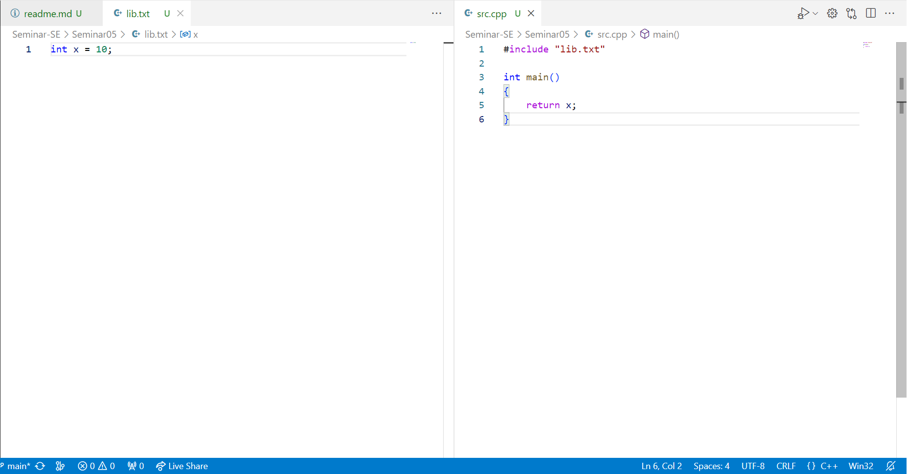
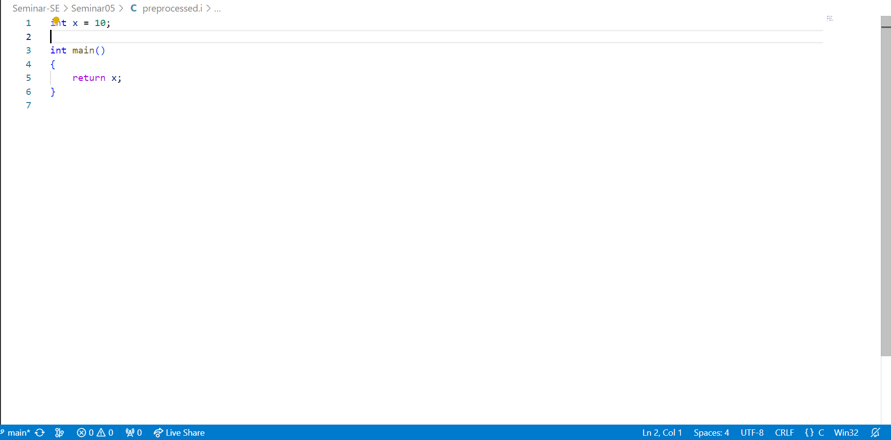

# Шести семинар по обектно ориентирано програмиране - информационни системи


## Разделна компилация.
Компилацията на един С++ проект е сложен процес. Все пак, най-просто казано, целта ни е от един (или повече) файла, съдържащи код написан на С++, да създадем изпълним файл, който представлява нашата програма. Изпълнимите файлове (.exe, .out) са файлове, които операционната система знае как да зареди и изпълни. Това са нашите програми. Но как точно се създават те?

Можем да разбием процесът на създаване на програма на следните стъпки:
1. Preprocessor - обработват се всички препроцесорни директиви
2. Compilation  - С++ се свежда до assembly и от там до object file (.obj, .o)
3. Linking

## Какво представлява препроцесора
Нека първо разгледаме какво представляват препроцесорните директиви. Тези, които ние ще разгледаме, са:
* #include
* #define
* #ifndef

Препроцесорните директиви започват със символа #. 

## include

Неформално - добавя файл в нашия файл.

Нека имаме следните два файла:


След изпълняването на препроцесора файла `src.cpp` би изглеждал по следния начин:



От уводния курс по програмиране познаваме директивата `#include`. Използвахме я в следния контекст `#include<iostream>`. В случая обаче не използваме символите `<>` а използваме `""`. И двата синтаксиса правят едно и също - добавят някакъв файл към нашия файл. Разликата е как търсят този файл:

* Използвайки синтаксиса `#include"..."` търсим файла по подаден път.
* Използвайки синтаксиса `#include<...>` търсим файла в някоя от предварително зададените директории в която се съдържат нашите библиотеки.

Наистина, би било неудобно да пишем всеки път дълги пътища за да намираме файловете си. Можем да зададем така наречените include директории в които нашия компилатор да търси файловете. Стандартните библиотеки като `iostream`, `cmath` и тн. се намират в директории, които са предварително известни за компилатора. Ако искаме същото поведение с наши библиотеки можем да добавим наша директория към include директориите.

Можем да подаваме всякакви файлове използвайки `#include`, но скоро ще видим, че това не е особено добра идея.

## define
Чрез препроцесорната директива `#define` дефинираме така наречените макрота (macros). Те не са нищо повече от замяна на един текст в друг.
Синтаксис:

```cpp
#define identifier replacement
```

нека разгледаме следния файл:

```cpp
#define FIVE 5

int main()
{
    return FIVE;
}
```

След препроцесването файлът изглежда така:

```cpp
int main()
{
    return 5;
}
```

Това е изключително удобно в някои случаи - можем да даваме други имена на неща, можем да "симулираме" глобални константи (които обаче не заемат памет). И разбира се, ако не внимаваме може и да счупим нещо

```cpp
#define true false
```

Можем да подаваме и аргументи на написаните от нас макрота:
```cpp
#define SQUARE(x) ((x) * (x))
int result = SQUARE(5);
```

Можем също така просто да дефинираме някакви макрота без стойност:

```cpp
#define VERSION_1_1
```

## #ifndef
Препроцесорната директива #ifndef проверява дали макро е дефинирано.
Това може да бъде полезно в много случаи.

```cpp
#ifndef VERSION_1_1
    std::cout << "Not running on version 1.1";
#else
    std::cout << "Running on version 1.1";
#endif
```
Както виждаме от примера, трябва да завършим проверката с `#endif`. Също така имаме възможност да окажем какво се случва, ако макрото е дефинирано.

## Компилация - но накратко!
След като препроцесора е свършил работата си, идва момента на компилацията. В резултат на нея се получават един (или повече) обектни файлове. Обектните файлове представляват машинен код, метаинформация за кода и символи (имена на функции, променливи, класове и тн.).

Компилацията е наистина сложен процес, включващ много оптимизации, анализи и стъпки, които често остават скрити за нас. Най-честата схема, по която се случва компилацията е, че C++ кодът се превръща в код на езика Assembly. Assembly е език, който е близък до машинния код. От там изходът се превръща (чрез асемблер) в машинен код (.obj, .o).

В дъното на всичко е превръщане на един текстов файл (.cpp) в един двоичен файл (.obj). 

Ако пишем всичко в един .cpp файл, цялото това превръщане ще стане **твърде бавно** (и не говорим за забавяне от порядъка на минути). 
Но защо да пишем всичко в един С++ файл? Все пак големите проекти могат да се разбият на много компоненти. Не можем ли да разбием кода си на много cpp файлове?

Можем (и е добре да го правим). Точно от там идва термина **разделна компилация.** Какво е предимството? Нека си представим проект, който има 2000 cpp файла. Нека също те са компилирани и имаме нужда да направим промяна в един от тях. Тогава ще се компилира **единствено този файл** и останалите файлове няма да се променят! Това прави компилацията **в пъти** по-бърза. Никой няма време да чака ден да се компилира промяна на 2 реда.

Твърдението, че единствено променения файл ще се компилира звучи много хубаво. То е истина ако предпоставката, че единствено този файл е промененя е истина. Ако променяме файл, който е инклуднат в други файлове, то и те се променят въпреки, че не ги променяме пряко.

Споменахме, че разбиваме проекта си на различни компоненти. Тези компоненти независими ли са, или една компонента може да използва функции/класове и т.н. от друга?

## Разделяне на .h и .cpp файлове
Тук идва тънкостта на разделната компилация. Стандартно, всяка компонента представлява двойка от `.h` и `.cpp` файл. Ние знаем какво е `.cpp` файл. Файловете с разширение `.h` от `header` или на български заглавни файлове **съдържат единствено дефинициите на функциите, класовете и т.н. които ще използваме.** В `.cpp` файловете се съдържа имплементацията на тези функции/класове.

Нека под *символ* разбираме всяка единица която може да се именува - променливи, функции, класове, константи, enum...

Неформално можем да си мислим следното:
Заглавните файлове **обещават** че някакъв символ съществува. Реализацията на този символ се намира в друг `.cpp` файл и се **компилира отделно.** 

Тоест, ако искаме да използваме символ от друг компонент, е достатъчно включим заглавния файл на компонента с #include и да го реализираме в cpp файла му.

## Как се намират символите? Linking
Чрез `.h` файловете давахме обещание, че някакъв символ съществува. Това обещание обаче трябва някой ден да се случи - все пак накрая всичко завършва в един изпълним файл. След като се компилират отделно всичси `.cpp` файлове получаваме няколко `.obj` файла. В някои от тях има обещания за съществуването на някакви символи. Работата на linking частта е да свърже обещаните символи с реализациите им. Тоест ако `A.cpp` очаква `void f()`, който е в `B.cpp` (и е обещан от `B.h`), то линкърът ще направи тази връзка. 

След като връзките биват изградени получаваме така желания изпълним файл.

# pragma once
Има опасност да вмъкнем един и същ `.h` файл два пъти. Това би довело до грешка, понеже тогава ще станат две декларации, които са едни и също. За да избегнем това поведение използваме препроцесорната директива `#pragma once`. Пишем я в началото на всеки `.h` файл.

## Агрегация и композиция

### Композиция
- отношение, при което вътрешния клас (B) няма предназначение в системата извън външния (A)
- A "притежава" B
- А отговаря за жизнения цикъл на B
- комания <- акаунти

```cpp
class A 
{
    B obj;
}
```
### Агрегация
- отношение, при която вътрешния клас (B) може да съществува независимо от външния (A)
- A "използва" B
- A не отговаря за жизнения цикъл на B
- комания <- хора


```cpp
class A 
{
    B& obj;
}

//или

class A 
{
    B* obj;
}

```

## Задача първа
Да се напише клас, който представлява събитие. Събитие се характеризира с:
* Име - дължина до 20 символа.
* Дата на събитието - Date от лекции
* Начален и краен час на събитието - класът Time от семинари.

## Задача втора
Да се напише клас за работа с крайно множество от събития (най-много 20). Класът трябва да съдържа:
* Добавяне на събитие
* Намиране на най-дългото събитие
* Премахване на последното събитие
* Премахване на събитие по име.
* Приемане на дата и връщане на максималния брой събития, които може да се посетят в този ден. (за да се посетят 2 събития, те трябва да не се пресичат).